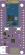
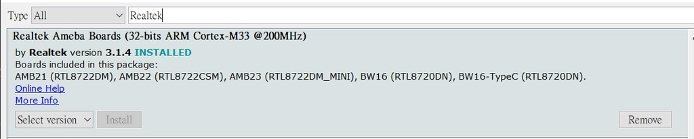

# RTL8720DN-A1-PICO-Type-C-board-fritzing-part

RTL8720DN-A1-PICO-Type-C-board-fritzing-part

## 喜歡請給個星星吧Orz

## debuging

This is RTL8720DN A1 PICO Type C fritzing part  
  

請注意本圖示pcb部分僅供參考，本人不負責任和pcb生產時產生誤差的損失  
The pcb part of this picture is for reference only, and I am not responsible for the loss caused by errors in the production of pcb  
pcb部分建議使用正規電路設計軟體設計  
It is recommended to use circuit design software to design the pcb part  

## where to buy

design by:  
Kevin’s Lab 的補給站 young257038@gmail.com  
shopee:  
<https://shopee.tw/Arduino-A1-PICO-Type-C-%E9%96%8B%E7%99%BC%E6%9D%BF%EF%BC%88-RTL8720DN-%E9%9B%99%E9%A0%BBWiFi-%E4%BD%8E%E5%8A%9F%E8%80%97%E8%97%8D%E7%89%995.0-BW16%EF%BC%89-i.670254765.19227118274>

## Specification

FSC-BW236 manual:  
<https://manuals.plus/zh-CN/feasycom/fsc-bw236-bluetooth-and-wi-fi-combo-module-manual#axzz7niwKbalv>

Model: A1 PICO(BW16)  
Antenna Type: IPEX connect or PCB Antenna  
Major Chipset: FSC-BW236(RTL8720DN)  
Power Supply: 3.6V ~ 4.2 V  
Dimension: 24 .016.0 3.0mm (LxWxH) ±0.2mm  
WIFI Wireless Features  
Wireless Standards: IEEE 802.11 a/b/g/n  
Frequency Range: 2.412 - 2.484GHz & 5.180 - 5.825GHz  
Data Rates: 802.11a : 6,9,12,18,24,36,48,54Mbps / 802.11b : 1,2,5.5,11Mbps /802.11g : 6,9,12,18,24,36,48,54Mbps  
Data Rates: 802.11n : MCS0 -- MCS7 @ HT20 /2.4GHz and 5GHz band  
Data Rates: 802.11n: MCS0 -- MCS7 @ HT40 /2.4GHz and 5GHz band  
Modulation Technique: DSSS (DBPSK, DQPSK, CCK) / OFDM (BPSK, QPSK, 16-QAM, 64-QAM)  
Work Mode: AP, Station, AP/Client Others  
Operating Temperature: - 20℃~85℃  
Storage Temperature: - 40℃~125℃  
Operating Humidity: 10%~90% (non - condensing)  
Storage Humidity: 5%~90% (non - condensing )  
Certification: RoHS compliance、FCC、CE、SRRC  
Bluetooth Wireless Features  
Wireless Standards: Bluetooth5.0 BLE  
Frequency Range: 2.402GHz - 2.480GHz  
Receiver Sensitivity: - 92dBm  
Transmit Power: 7±2dBm  

  

Realtek RTL8720DN 是一個具有 Wifi + Bluetooth  無線晶片, Wifi 且支援雙模  (802.11 a/b/g/n 1x1, 2.4GHz & 5GHz ) 和低功耗的 BLE 5。

處理器內核採用 Dual processor core 設計 集成 ARM V8M Cortex-M33  (指令集相容於 Cortex-M4F) 及 ARM V8M Cortex-M23 (相容於 Cortex-M0+)  。

A1 PICO 是基於 RTL8720DN (BW16 Module) 所設計的開發板，而 RTL8720DN 具有 WIFI 4G/5G 及低功耗 BLE 5 的無線功能。

開發板特色:

1. 內建 USB 5V 可自複式保險絲。因為做實驗難免會有誤接短路的問題,尤其是 USB 是直接連接電腦。雖然 USB Hub 也有相對應的保護,多層保護可以減少發生意外機率。  
2. 電池連接口 JST 2.00mm 。
 在很多應用是不方便連接固定電源,在應用上會更方便。若同時接入 USB 5V 會自動切換 USB 做為主要電源。  
3. 因為要使用電池應用, 所以也特別挑選工作效率好的 LDO。使電池發揮最大的效能。預設電壓區間是 3.6V ~ 4.2V  
4. 預裝 I2C 提升電阻，在應用於 I2C 時都需要提升電阻,有時臨時還真找不到 。現在只要將短路 pin 接上就好。  
5. 支援 Auto flash 功能。  

簡易使用說明:

打開 Arduino IDE , 點選 “File” -> “Preferences”

在 Additional Boards Manager 欄位輸入或貼上

<https://github.com/ambiot/ambd_arduino/raw/master/Arduino_package/package_realtek.com_amebad_index.json>

完成後,在

“Tools” -> “Board” -> “Boards Manager”

搜尋 “Realtek”  
  
選擇安裝。

安裝完成後,選擇 BW(RTL8720DN)
  
溫馨提醒:

本開發板有 Auto flash 自動上傳功能, 請將 Auto Upload mode 設定為 Enable
  

## MIT License

Copyright (c) 2022 HuangYuTse

Permission is hereby granted, free of charge, to any person obtaining a copy
of this software and associated documentation files (the "Software"), to deal
in the Software without restriction, including without limitation the rights
to use, copy, modify, merge, publish, distribute, sublicense, and/or sell
copies of the Software, and to permit persons to whom the Software is
furnished to do so, subject to the following conditions:

The above copyright notice and this permission notice shall be included in all
copies or substantial portions of the Software.

THE SOFTWARE IS PROVIDED "AS IS", WITHOUT WARRANTY OF ANY KIND, EXPRESS OR
IMPLIED, INCLUDING BUT NOT LIMITED TO THE WARRANTIES OF MERCHANTABILITY,
FITNESS FOR A PARTICULAR PURPOSE AND NONINFRINGEMENT. IN NO EVENT SHALL THE
AUTHORS OR COPYRIGHT HOLDERS BE LIABLE FOR ANY CLAIM, DAMAGES OR OTHER
LIABILITY, WHETHER IN AN ACTION OF CONTRACT, TORT OR OTHERWISE, ARISING FROM,
OUT OF OR IN CONNECTION WITH THE SOFTWARE OR THE USE OR OTHER DEALINGS IN THE
SOFTWARE.  